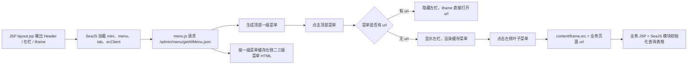
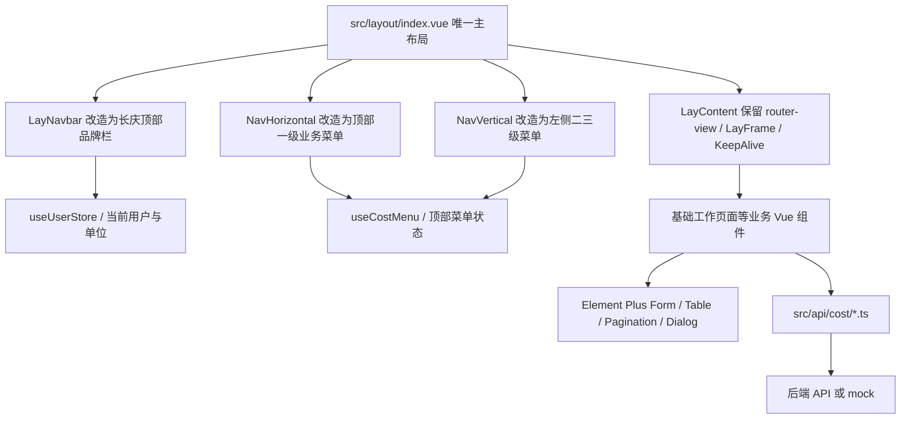

# 长庆油田三段式布局迁移实现文档

生成日期：2026-05-09

目标：将 `cost-cqcost` 截图中的“长庆油田公司工程造价管理信息系统”整体布局，迁移并重建到 `pure-admin-thin` 项目中。迁移目标不是把 JSP/iframe 旧实现原样搬入 Vue，而是在保留视觉结构、菜单行为、业务列表交互和权限语义的基础上，改写为 `pure-admin-thin` 的 Vue 3、TypeScript、Vue Router、Pinia、Element Plus 实现。

## 资料来源

- 旧系统本地代码：`E:\cost-cqcost`
- 旧系统已有扫描文档：`E:\cost-cqcost\.planning\codebase\STACK.md`、`ARCHITECTURE.md`、`STRUCTURE.md`
- 旧系统 zread：<https://zread.ai/wsh-dot/cost-cqcost-ai-readable/17-frontend-and-web-resources>
- 新系统 zread：<https://zread.ai/wsh-dot/pure-admin-thin>
- 新系统本地代码：`E:\pure-admin-thin`

## 旧系统如何实现该布局

旧系统是传统 Java Web 单体。页面由 JSP 输出基础 DOM，SeaJS 模块负责交互初始化，业务内容通过 iframe 承载。截图里的整体布局主要由 `WEB-INF/jsp/common/layout.jsp`、`js/common/menu.js`、业务 JSP 和业务 JS 共同完成。

核心结构如下：



### 外壳布局

`layout.jsp` 定义三个固定区域：

- 顶部 `Header`：包含 logo、系统名称、用户信息、单位切换、部门首页、个人信息、退出、顶部模块导航、时间。
- 左侧 `#left`：模块内菜单容器，由 JS 动态填充。
- 右侧 `#right`：主内容区，内部是 `#contentIframe`。

布局使用绝对定位，顶部固定高度约 121px，左侧默认宽度 180px，中间有 `#middle` 作为拖拽分隔条。拖拽逻辑直接操作 DOM 宽度：`left.style.width = iT + "px"`，`right.style.width = bodyWidth - iT - middleWidth - 2 + "px"`。

### 菜单与路由

`js/common/menu.js` 的行为是数据驱动的：

- 请求 `contextPath + "/admin/menu/getAllMenu.json"` 获取完整菜单。
- 一级菜单渲染到 `#topMenu`。
- 每个一级菜单的二三级菜单被拼接成 HTML 并缓存到 `store-js`，key 形如 `menu_${code}`。
- 点击一级菜单时：
  - 如果该菜单有直接 URL，隐藏左栏并让 iframe 打开 URL。
  - 如果没有直接 URL，显示左栏，填充该一级菜单下的二三级菜单，并默认触发第一个叶子菜单。
- 点击左侧叶子菜单时，设置 `#contentIframe.src = url`。

这套机制本质上是“顶级业务域切换 + 左侧子功能树 + iframe 页面装载”。

### 业务页面模式

截图中的“基础工作 / 党建工作”页面对应：

- JSP：`src/main/webapp/WEB-INF/jsp/floorcost/party/party.jsp`
- JS：`src/main/webapp/js/floorcost/party/party.js`
- Controller：`src/main/java/com/toone/cost/floorcost/workassume/web/PartyController.java`

业务页面模式：

- JSP 输出标题、搜索表单、按钮和空表格。
- SeaJS 加载业务模块 `js/floorcost/party/party`。
- JS 使用 `table.js` 包装 Bootstrap Table，请求 `/floorcost/party/listPage.json`。
- 搜索项包括标题、置顶状态、发布状态、信息类型、有效时间。
- 表格列包括序号、标题、信息类型、有效时间、创建人、附件、修改、删除、发布/撤回、置顶/还原。
- 按钮权限由 JSP 的 `<security:authorize>` 和 JS 的 `cache.isPermCache("work_edit")` 双重控制。
- 新增、编辑、查看、附件都通过 `dialog.openFrame...` 打开 iframe 弹窗。
- 发布、置顶、删除通过 AJAX 调用 `/update.json` 或 `/delete.json` 后刷新表格。

### 后端数据语义

`PartyController` 继承 `BaseAbstractController<PublicInfoService, PublicInfoForm>`，列表查询由通用分页能力提供。关键查询规则：

- `topic` 使用包含查询。
- `issuanceTag` 按发布状态过滤。
- `infoType` 精确过滤，并默认限制 `infoType < 60`。
- `ableDate` 按开始、结束时间过滤。
- 排序使用 `createDate DESC` 和 `topStatus DESC`。

## pure-admin-thin 的现状

`pure-admin-thin` 是现代 Vue 后台骨架，当前技术栈来自 `package.json` 与 zread/wiki：

- Vue 3.5、TypeScript、Vite 7
- Vue Router 4
- Pinia 3
- Element Plus 2
- @pureadmin/table、@pureadmin/utils
- TailwindCSS 4、SCSS
- axios、dayjs、mitt、@vueuse/core
- 已有在线造价业务入口：`src/router/modules/projectWorkbench.ts`
- 已有造价业务页面：`src/views/cost/project-management/**`

布局现状：

- `src/layout/index.vue` 是整体 shell。
- `src/layout/components/lay-navbar/index.vue` 负责垂直布局顶部栏。
- `src/layout/components/lay-sidebar/NavHorizontal.vue` 负责横向菜单模式。
- `src/layout/components/lay-content/index.vue` 承载 `router-view`、标签页、keep-alive 和滚动容器。
- `src/router/index.ts` 会自动导入 `src/router/modules/**/*.ts` 静态路由。
- `src/router/utils.ts` 支持后端动态路由、菜单过滤、权限过滤、`meta.auths` 按钮权限、`meta.frameSrc` iframe 路由。
- `public/platform-config.json` 当前默认 `Layout: "vertical"`、`FixedHeader: true`、`ShowLogo: false`、`HideFooter: false`。

## 迁移原则

1. 视觉上复刻截图的工作台骨架：蓝色品牌头部、顶部一级业务域、左侧二三级菜单、右侧内容区、紧凑表单和数据表格。
2. 技术上使用 Vue 组件与路由，不继续使用 JSP 拼 HTML、SeaJS、Bootstrap Table 和 iframe 作为主页面承载方式。
3. 仅在确实需要接入历史页面时使用 `meta.frameSrc` 和 `layout/frame.vue`，新页面优先写成 Vue SFC。
4. 菜单、权限、用户信息从数据模型驱动，避免把旧系统的 DOM 拼接逻辑迁移到前端。
5. 页面密度和操作语义保留旧系统风格，但交互组件使用 Element Plus。

## 目标架构



项目未来就是“长庆油田公司工程造价管理信息系统”，因此不再保留通用 PureAdmin 多布局产品形态，也不新增 `changqing` 布局分支。推荐做法是把现有 `src/layout/index.vue` 直接改造成唯一主布局：保留 Router、Pinia、权限、KeepAlive、`LayFrame`、动态菜单和内容渲染能力，替换顶部、左侧、主体坐标和视觉外壳。

关键约束：

- 固定为单一长庆工程造价布局，不再提供 `vertical`、`horizontal`、`mix` 的用户切换入口。
- 不把业务页面逻辑写进布局组件，布局只处理系统外壳、菜单、尺寸和用户入口。
- 尽量复用现有组件文件，避免保留一套无人使用的模板外壳。
- 继续复用 `LayContent`，从而保留 `router-view`、`LayFrame`、KeepAlive、标签页和页脚控制。
- 对 `sidebar.scss` 做有边界的全局布局改造，因为系统唯一外壳已经变成长庆布局。

## 推荐文件结构

```text
src/
  layout/
    index.vue                         # 唯一主布局，改造成长庆三段式外壳
    hooks/
      useLayout.ts                    # 固定默认 layout，减少多布局切换语义
      useCostClock.ts                 # 顶部日期时间
      useCostMenu.ts                  # 顶部一级菜单与左侧菜单联动
    components/
      lay-navbar/
        index.vue                     # 改造成品牌栏 + 用户区 + 部门入口
      lay-sidebar/
        NavHorizontal.vue             # 改造成截图中的顶部一级业务菜单
        NavVertical.vue               # 改造成当前一级菜单下的二三级左侧菜单
        components/
          SidebarItem.vue             # 视情况保留或轻量适配菜单项
      lay-content/
        index.vue                     # 保留，必要时收紧边距和滚动行为
      lay-tag/
        index.vue                     # 可隐藏或保留为内部标签能力
      cost-menu.ts                    # 静态菜单模型或接口适配
  router/
    modules/
      cost.ts                         # 或改造现有 projectWorkbench.ts
  views/
    cost/
      foundation/
        party-work.vue
        components/
          PartyWorkFormDialog.vue
          AttachmentDialog.vue
        mock.ts
        types.ts
  api/
    cost/
      foundation.ts
  style/
    sidebar.scss                      # 改造现有布局坐标
    changqing.scss                    # 长庆颜色、表格、菜单补充样式
```

## 路由设计

路由不再通过 `meta.layout` 切换布局；所有业务路由默认进入现有 `@/layout/index.vue`，该布局本身已经是长庆外壳。可以新增 `src/router/modules/cost.ts`，也可以在现有 `projectWorkbench.ts` 基础上重命名、扩展。

```ts
const Layout = () => import("@/layout/index.vue");

export default {
  path: "/cost",
  name: "Cost",
  component: Layout,
  redirect: "/cost/foundation/party-work",
  meta: {
    icon: "ep:data-board",
    title: "长庆油田造价",
    rank: 0
  },
  children: [
    {
      path: "/cost/foundation/party-work",
      name: "CostFoundationPartyWork",
      component: () => import("@/views/cost/foundation/party-work.vue"),
      meta: {
        title: "党建工作",
        topMenuCode: "foundation",
        sideMenuCode: "party-work",
        auths: ["work_edit"],
        hideFooter: true,
        hiddenTag: true
      }
    }
  ]
} satisfies RouteConfigsTable;
```

说明：

- `topMenuCode` 和 `sideMenuCode` 用于长庆菜单判断当前顶部与左侧激活项。
- `meta.auths` 对应旧系统 `work_edit` 权限，配合 `hasAuth("work_edit")` 控制新增、编辑、删除、发布、置顶等按钮。
- `hideFooter` 与 `hiddenTag` 用于贴近旧系统的全屏工作台感。
- 如果需要迁移旧 JSP 页面，可临时使用 `meta.frameSrc`，但最终应逐步改成 Vue 页面。
- `platform-config.json` 建议固定 `Layout: "vertical"`、`FixedHeader: true`、`ShowLogo: false`，并隐藏布局切换面板，避免用户切到不再维护的通用模板模式。

## 菜单模型

旧系统菜单来自 `/admin/menu/getAllMenu.json`，结构包含 `code`、`name`、`url`、`childs`。新系统建议定义统一类型：

```ts
export interface CostMenuItem {
  code: string;
  title: string;
  path?: string;
  icon?: string;
  children?: CostMenuItem[];
  auths?: string[];
}
```

初始菜单可以先放在 `src/layout/cost-menu.ts`，由 `NavHorizontal.vue` 和 `NavVertical.vue` 共同使用：

```ts
export const costMenus: CostMenuItem[] = [
  { code: "desktop", title: "我的桌面", path: "/cost/desktop" },
  { code: "compile", title: "造价编制", children: [] },
  { code: "audit", title: "造价审核", children: [] },
  { code: "manage", title: "造价管理", children: [] },
  { code: "price", title: "价格管理", children: [] },
  { code: "qualification", title: "资质管理", children: [] },
  {
    code: "foundation",
    title: "基础工作",
    children: [
      {
        code: "party",
        title: "党建工作",
        children: [
          {
            code: "party-work",
            title: "党建工作",
            path: "/cost/foundation/party-work"
          }
        ]
      },
      {
        code: "info-maintenance",
        title: "信息维护",
        path: "/cost/foundation/info"
      },
      {
        code: "department-profile",
        title: "部门概况",
        path: "/cost/foundation/department"
      },
      {
        code: "work-summary",
        title: "工作总结",
        path: "/cost/foundation/summary"
      },
      {
        code: "department-honor",
        title: "部门荣誉",
        path: "/cost/foundation/honor"
      },
      {
        code: "system-compile",
        title: "制度汇编",
        path: "/cost/foundation/institution"
      }
    ]
  },
  { code: "evaluation", title: "考评管理", children: [] },
  { code: "business", title: "业务交流", children: [] },
  { code: "system", title: "系统管理", children: [] }
];
```

后续接真实接口时，只需要把旧系统 `childs` 字段映射为 `children`，把 `url` 映射为 `path` 或 `frameSrc`。

## 主布局改造实现

### `src/layout/index.vue`

`index.vue` 从通用布局编排器改成系统唯一主外壳。它仍然组合现有组件，但结构改为截图对应的三段式：

- 顶部第一行：`LayNavbar`，改造成品牌栏和用户区。
- 顶部第二行：`NavHorizontal`，改造成一级业务菜单和日期时间。
- 左侧区域：`NavVertical`，只显示当前一级菜单下的二三级菜单。
- 右侧区域：`LayContent`，继续承载业务页面。
- 系统设置 `LaySetting` 默认移除或隐藏布局切换相关入口。

示意：

```vue
<template>
  <div ref="appWrapperRef" :class="['app-wrapper', set.classes]">
    <div class="cq-header">
      <LayNavbar />
      <NavHorizontal />
    </div>

    <NavVertical class="cq-sidebar" />

    <main class="main-container cq-main">
      <LayContent :fixed-header="true" />
    </main>
  </div>
</template>
```

### `lay-navbar/index.vue`

改造成截图顶部第一行：

- 左侧：logo 与系统名“长庆油田公司工程造价管理信息系统”。
- 右侧：系统管理员、当前单位、切换、部门首页、个人信息、退出。
- 高度建议 80px，背景 `#063da5` 或 `#053ca6`，文字白色，用户重点信息黄色。

实现要点：

- logo 建议放在 `src/assets/changqing-logo.svg` 或 `public/changqing-logo.png`。
- 当前日期用 `dayjs` 每分钟刷新，格式：`YYYY-M-D dddd`。
- 退出复用 `useUserStoreHook().logOut()`。
- 个人信息和单位切换使用 `ElDialog`，不再打开 iframe。
- 现有搜索、全屏、通知、设置入口如果不符合截图，应移除或移到系统管理页，不保留在主头部。

### `NavHorizontal.vue`

对应截图第二行蓝色顶部导航：

- 渲染一级菜单。
- 当前菜单用白色文字和底部高亮线。
- 点击有 `path` 的一级菜单直接 `router.push(path)` 并隐藏左侧菜单。
- 点击有 `children` 的一级菜单切换左侧菜单组，并自动跳转第一个可访问叶子节点。
- 右侧显示当前日期时间，替代原有全屏、通知、头像下拉等通用后台工具。

### `NavVertical.vue`

对应左侧“基础工作 / 党建工作 / 信息维护 ...”：

- 只显示当前顶部菜单下的二三级菜单。
- 一级组可展开折叠，叶子节点点击路由跳转。
- 使用 Element Plus 的 `el-menu` 可以减少状态维护，但需要自定义样式贴近旧系统。
- 如果要完全复刻截图，推荐自绘 `<ul>`，因为旧系统左栏更像轻量树而不是标准后台菜单。

### 拖拽分隔条

对应旧系统 `#middle` 拖拽条：

- 默认左侧宽度按旧系统设为 180px。
- 为保持旧系统行为，拖拽最小宽度为 0px，最大只限制到当前视口宽度，不额外设置业务最大宽度。
- 鼠标拖拽时更新 `leftWidth`。
- 可以放在 `index.vue` 中作为 `NavVertical` 与 `LayContent` 之间的窄条，也可以抽成 `layout/components/lay-sidebar/components/SidebarResizeHandle.vue`。
- 小屏时自动隐藏左侧或转抽屉。

### 内容区复用 `LayContent`

对应旧系统右侧 iframe 内容区，但新系统用 `router-view`：

- 右侧内容区域 `overflow: hidden`，页面内部自己处理滚动。
- 默认背景白色，边框用浅灰。
- 需要保留 screenshot 中红/绿边框标注时，仅在开发调试样式中开启，不建议作为正式 UI。
- 继续使用 `src/layout/components/lay-content/index.vue`，不要再新建一套内容渲染组件。

## 图标与图片资源迁移

截图里的图标和图片属于界面复刻范围，但要分层处理：品牌资产使用真实图片迁移，通用操作图标使用现有 Iconify / Element Plus 图标替代。右下角蓝色 Codex 宠物图标是当前 Codex 客户端叠加元素，不属于长庆油田系统页面，不需要实现。

### 资源归类

| 位置           | 旧系统表现                             | 新系统实现方式                                                              |
| -------------- | -------------------------------------- | --------------------------------------------------------------------------- |
| 顶部左上角     | 长庆/中石油风格 logo                   | 从旧系统资源中确认后放入 `src/assets/cost/`，在 `lay-navbar/index.vue` 引用 |
| 顶部用户区     | 用户、单位、首页、个人信息、退出小图标 | 使用 Iconify 图标，颜色跟随黄色/白色文字                                    |
| 顶部一级菜单   | 当前菜单橙色短下划线                   | CSS 实现，不需要图片                                                        |
| 顶部日期       | 时钟图标 + 日期文本                    | 使用 Iconify 时钟图标 + `dayjs`                                             |
| 左侧菜单       | 模块图标、小三角展开符                 | 优先 CSS / Iconify；如果旧系统有特定业务图标，再迁移图片                    |
| 查询按钮       | 放大镜                                 | Iconify 或 Element Plus `Search` 图标                                       |
| 新建按钮       | 加号                                   | Iconify 或 Element Plus `Plus` 图标                                         |
| 日期选择       | 日历                                   | Element Plus 日期选择器自带图标                                             |
| 表格附件       | 上传/附件图标                          | Iconify `upload` / `attachment` 类图标                                      |
| 表格修改       | 编辑图标                               | Iconify `edit` 类图标                                                       |
| 表格删除       | 删除/关闭图标                          | Iconify `close` / `delete` 类图标                                           |
| 右下角蓝色形象 | Codex 宠物图标                         | 不实现，不纳入系统资源                                                      |

### 推荐资源目录

```text
src/
  assets/
    cost/
      changqing-logo.png
      favicon.ico
      menu/
        foundation.svg        # 仅当需要真实业务图标时添加
        system.svg
```

如果 logo 来自旧系统，可以优先从以下路径查找并人工确认：

- `E:\cost-cqcost\src\main\webapp\skin\images\login\logo.png`
- `E:\cost-cqcost\src\main\webapp\skin\images\new-login\logo.png`
- `E:\cost-cqcost\src\main\webapp\skin\index\css\img\*`
- `E:\cost-cqcost\src\main\webapp\skin\new_index\css\*`

注意：旧系统资源目录里有很多登录页、广告、WEC、找回密码等图片，不应整目录搬迁。只迁移长庆布局真实需要的品牌图、业务图标和 favicon。

### 图标使用规范

- 通用图标使用项目现有 `~icons/...` Iconify 方案，避免重新引入 Font Awesome。
- 只在必须高度还原品牌或业务专属图形时使用图片资源。
- 图标按钮需要 `title` 或 `aria-label`，例如上传、编辑、删除。
- 表格操作图标保持紧凑尺寸，建议 16px 到 18px，颜色沿用旧系统蓝色操作色。
- 顶部用户区图标不做独立按钮边框，保持旧系统“图标 + 文本链接”的轻量样式。

## 基础工作列表页实现

页面：`src/views/cost/foundation/party-work.vue`

### 数据类型

```ts
export interface PartyWorkRow {
  id: string;
  topic: string;
  infoType: string;
  ableDate: string;
  createUserName: string;
  fileId?: string;
  issuanceTag: "0" | "1";
  topStatus: "0" | "1";
}

export interface PartyWorkQuery {
  topic?: string;
  topStatus?: "0" | "1";
  issuanceTag?: "0" | "1";
  infoType?: string;
  dateRange?: [string, string];
  pageNo: number;
  pageSize: number;
}
```

### 页面布局

使用 Element Plus：

- `el-form` inline 展示查询条件。
- `el-input` 对应标题。
- `el-select` 对应置顶状态、发布状态、信息类型。
- `el-date-picker type="daterange"` 对应有效时间。
- `el-button` 查询、重置、新建。
- `el-table` 展示数据。
- `el-pagination` 放在底部右侧，保持旧系统分页语义。

视觉约束：

- 页面标题 `基础工作`，下方细分标题 `党建工作`。
- 表格要紧凑：`size="small"`，行高 32-36px。
- 标题列为蓝色链接，点击打开查看弹窗。
- 发布状态已发布为绿色，未发布为红色。
- 操作列用图标按钮，不用大按钮。

### 操作行为

- 查询：调用 `fetchPartyWorkPage(query)`。
- 重置：清空表单并回到第一页。
- 新建：打开 `PartyWorkFormDialog`。
- 查看：打开只读弹窗。
- 编辑：仅 `hasAuth("work_edit") && row.issuanceTag !== "1"` 时显示。
- 删除：仅未发布且有权限时显示，二次确认后调用删除。
- 附件：打开 `AttachmentDialog`。
- 发布/撤回：调用 `updatePartyWorkStatus(id, { issuanceTag })`。
- 置顶/还原：调用 `updatePartyWorkStatus(id, { topStatus })`。

旧系统在已发布状态下隐藏编辑、删除、上传按钮，这个规则必须保留。

## API 封装

新增 `src/api/cost/foundation.ts`：

```ts
import { http } from "@/utils/http";
import type {
  PartyWorkQuery,
  PartyWorkRow
} from "@/views/cost/foundation/types";

export function fetchPartyWorkPage(params: PartyWorkQuery) {
  return http.request<{
    list: PartyWorkRow[];
    total: number;
  }>("get", "/floorcost/party/listPage.json", { params });
}

export function updatePartyWorkStatus(
  id: string,
  payload: Partial<Pick<PartyWorkRow, "issuanceTag" | "topStatus">>
) {
  return http.request("post", "/floorcost/party/update.json", {
    data: { id, ...payload }
  });
}

export function deletePartyWork(id: string) {
  return http.request("post", "/floorcost/party/delete.json", {
    data: { id }
  });
}
```

如果当前没有真实后端，先在 `mock/` 或页面同目录 `mock.ts` 提供本地数据，接口层保持同名函数，后续替换实现即可。

## 权限迁移

旧系统权限来源：

- JSP：`<security:authorize ifAnyPermission="<%=PersConstants.WORK_EDIT%>">`
- JS：`cache.isPermCache("work_edit")`

新系统权限落点：

- 路由 `meta.auths: ["work_edit"]`
- 页面内使用 `hasAuth("work_edit")`
- 或使用已有自定义指令体系，如果项目中已启用按钮权限指令。

按钮规则：

| 操作      | 权限        | 状态限制              |
| --------- | ----------- | --------------------- |
| 新建      | `work_edit` | 无                    |
| 编辑      | `work_edit` | `issuanceTag !== "1"` |
| 删除      | `work_edit` | `issuanceTag !== "1"` |
| 上传附件  | `work_edit` | `issuanceTag !== "1"` |
| 发布/撤回 | `work_edit` | 无                    |
| 置顶/还原 | `work_edit` | 无                    |
| 查看      | 登录可见    | 无                    |

## 样式实现

直接改造现有 `src/style/sidebar.scss` 的布局坐标，并新增或补充 `src/style/changqing.scss` 存放长庆主题变量和局部视觉规则。因为项目唯一外壳就是长庆布局，样式可以作为全局布局样式加载，但应避免无选择器地覆盖 Element Plus。

建议变量：

```scss
:root {
  --cq-blue: #063da5;
  --cq-blue-deep: #07358f;
  --cq-blue-nav: #0040aa;
  --cq-yellow: #ffd400;
  --cq-green: #0a9f28;
  --cq-red: #ff1f1f;
  --cq-border: #dcdfe6;
  --cq-bg: #f5f7fb;
  --cq-side-width: 180px;
}
```

关键样式：

- 顶部 header 高度 80px。
- 顶部 nav 高度 36px。
- 主体高度 `calc(100vh - 116px)`。
- `.sidebar-container` 从旧的 `top: 0` 改为 `top: 116px`。
- `.main-container` 从旧的左侧避让布局改为同时避让顶部和左侧：`margin-left: var(--cq-side-width)`、`height: calc(100vh - 116px)`。
- 拖拽时将 `--cq-side-width` 更新为 `clamp(0px, dragWidth, 100vw)` 等效结果，保持旧系统 `0` 到 `document.body.clientWidth` 的范围。
- `.fixed-header` 不再只占 sidebar 右侧，而是全宽顶部区域。
- 内容区 padding 20px，与截图一致。
- 表格边框使用 `#dcdfe6`，表头背景 `#f5f7fa`。
- 表格和表单样式建议限定在 `.cq-page`、`.cq-table`、`.cq-search-form` 等页面级 class 下。

## 响应式策略

旧系统基本面向桌面大屏；新系统仍应处理窄屏：

- 宽度大于 1200px：完整三段式布局。
- 760px 到 1200px：保留用户拖拽后的左侧宽度，表格横向滚动。
- 小于 760px：顶部菜单改为横向滚动，左侧菜单放入抽屉，内容区全宽。

`pure-admin-thin` 已有 `useResizeObserver` 和 `useAppStoreHook().setViewportSize`，应优先复用这些状态；只有拖拽宽度、顶部菜单激活项这种长庆专属状态，才放在 `layout/hooks/useCostMenu.ts` 或组件内部。

## 分阶段实施计划

### 第 1 阶段：布局骨架

1. 直接改造 `src/layout/index.vue` 为长庆三段式外壳。
2. 改造 `lay-navbar/index.vue` 为品牌栏和用户区。
3. 改造 `NavHorizontal.vue` 为顶部一级业务菜单。
4. 改造 `NavVertical.vue` 为当前一级菜单下的二三级菜单。
5. 复用 `LayContent` 完成右侧内容渲染，不新建第二套路由出口。
6. 改造 `src/style/sidebar.scss` 的顶部、左侧、主体坐标。
7. 验证 `/cost/foundation/party-work` 可以进入长庆外壳并正确激活菜单。

### 第 2 阶段：党建工作列表页

1. 新建 `src/views/cost/foundation/party-work.vue`。
2. 新建 `types.ts`、`mock.ts`、`components/PartyWorkFormDialog.vue`、`components/AttachmentDialog.vue`。
3. 使用 mock 还原截图中的 15 行表格数据。
4. 实现查询、重置、分页、查看、新增、编辑、删除、发布、置顶。
5. 用 `hasAuth("work_edit")` 控制按钮显示。

### 第 3 阶段：接口替换

1. 新建 `src/api/cost/foundation.ts`。
2. 与后端确定分页响应结构。如果旧后端仍返回 Bootstrap Table 风格字段，需要在 API 层适配为 `{ list, total }`。
3. 处理日期参数：`dateRange[0] -> startDate`，`dateRange[1] -> endDate`。
4. 处理字典：旧系统 `cache.getSelectCache("50", value)` 应改为前端字典接口或静态字典。

### 第 4 阶段：视觉校准

1. 对照截图校准 header、nav、left menu、表单、表格、分页。
2. 保证 1920x943、1366x768、移动宽度下无重叠。
3. 用 Browser/Playwright 检查主要页面截图。

### 第 5 阶段：扩展其他左侧菜单

按同一模式逐步添加：

- 信息维护
- 部门概况
- 工作总结
- 部门荣誉
- 制度汇编

每个页面都应拆为：路由、页面 SFC、类型、API、mock、局部组件。

## 验收标准

- 顶部品牌、用户信息、一级菜单与截图结构一致。
- 点击“基础工作”后左侧出现对应二三级菜单。
- 点击“党建工作”后右侧进入 Vue 页面，不依赖 iframe。
- 查询表单字段、表格列、分页、状态颜色与旧系统一致。
- 已发布行隐藏编辑、删除、上传附件入口。
- 发布/撤回、置顶/还原都有二次确认。
- 路由刷新后顶部菜单和左侧菜单仍能正确激活。
- 页面在 1366px 以上宽度无横向布局错乱。
- 新实现复用现有 `LayContent`、路由守卫、权限过滤、KeepAlive，不再保留默认 PureAdmin 外壳。

## 风险与注意事项

- 旧系统的菜单、权限、字典很多来自数据库和私有平台缓存，迁移时不要把这些逻辑硬编码死在页面里。
- 旧系统使用 iframe 弹窗保存后调用父页面刷新；Vue 版本应改为组件事件和 Promise 回调。
- 旧系统的分页参数可能是 Bootstrap Table 风格，接口层要做一次适配，避免页面组件直接感知旧协议。
- `pure-admin-thin` 会把三级以上路由拍平成二级以支持 keep-alive，因此菜单层级与路由层级不要强绑定。
- 直接改造主布局会影响所有已接入路由；这是符合产品定位的，但改造前要确认现有 `project-workbench` 页面也能在新外壳下正常显示。
- 隐藏或移除布局切换能力后，`LaySetting` 中与布局相关的配置也要同步清理，避免出现无效配置。

## 推荐优先级

最高优先级先做“改造现有 `src/layout/index.vue` 唯一主布局 + 党建工作列表页 mock 版”。这能最快验证截图中的外壳、菜单、密集表格和权限状态是否迁移正确，同时让 pure-admin-thin 现有布局代码继续服务长庆油田工程造价系统。真实接口、附件上传和更多基础工作页面可以在布局稳定后逐步接入。
